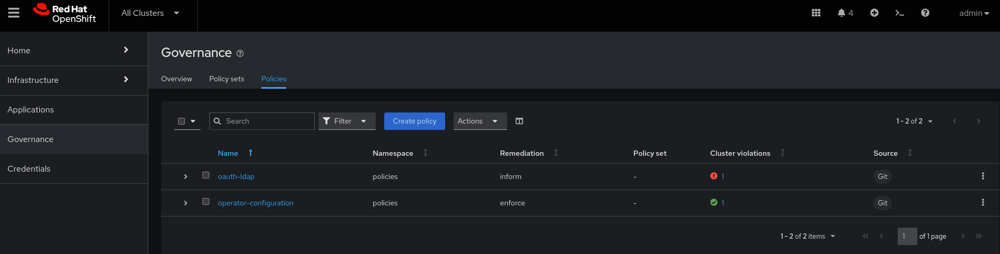

# Red Hat Advanced Cluster Management for Kubernetes GitOps Example


##  Overview

This repository consists of a simple example GitOps pattern for deploying policies in Red Hat Advanced Cluster Management for Kubernete (RHACM) using the [policy-generator-plugin](https://github.com/open-cluster-management-io/policy-generator-plugin) for kustomize. There are two policies that will be deployed:

* `infrastructure-nodes` - "Migrates" the Monitoring, Default Registry, and Default Router to infrastructure nodes by adding the node-selector and tolerations per [Red Hat Documentation: Moving Resources to Infrastructure Machinesets](https://docs.openshift.com/container-platform/4.14/machine_management/creating-infrastructure-machinesets.html#moving-resources-to-infrastructure-machinesets)
* `oauth-ldap` - Deploys a ldap based oauth config to all clusters managed by RHACM to secure console access to OpenShift
* `operator-configuration` - Deploy the Red Hat [web-terminal](https://github.com/redhat-developer/web-terminal-operator) Operator to all clusters

Thank you to [Alberto Gonzalez de Dios](https://github.com/albertogd) for his phenomeal GitOps series.

## Assumptions

* A Red Hat OpenShift cluster at 4.14+
* Red Hat Advanced Cluster Management for Kubernetes installed at 2.10+
* The OpenShift `oc` client utility installed locally 
* You have Infrastructure node machinesets in place [Red Hat Documentation: Creating Infrastructure Machinesets](https://docs.openshift.com/container-platform/4.14/machine_management/creating-infrastructure-machinesets.html)

## Instructions for Deployment

1.  Create a `policies` namespace if one doesn't already exist, and switch to it. If you want to use a different namespace, this can be altered in `gitops-policies-channel-and-subscription.yaml` and `/configuration/configuration-policies.yaml`

    ```console
    $ oc new-project policies
    $ oc project policies
    ```

2.  Since RHACM 2.4, `policy.open-cluster-management.io/v1` resources are no longer deployed by an application subscription by default. A subscription administrator needs to deploy the application subscription to change this default behavior. Assuming the user you have logged in as doesn't already have this `cluster-role` run the following command:

    ```console
    $ oc adm policy add-cluster-role-to-user open-cluster-management:subscription-admin $(oc whoami)
    ```

    If you don't run the prior command you will see an error like the below appear:

    ```console
    $ oc get subscriptions gitops-policies-subscription-local -o yaml
    [...]
      appstatusReference: kubectl get appsubstatus -n policies gitops-policies-subscription
      lastUpdateTime: "2024-04-06T19:09:41Z"
      message: Active
      phase: Failed
      reason: 'not deployed by a subscription admin. the resource apiVersion: policy.open-cluster-management.io/v1
        kind: PlacementBinding is not deployed, not deployed by a subscription admin.
        the resource apiVersion: policy.open-cluster-management.io/v1 kind: Policy is
        not deployed'
    ```

    For more information on this consult: [Product Documentation: RHACM: Granting subscription administrator privilege](https://access.redhat.com/documentation/en-us/red_hat_advanced_cluster_management_for_kubernetes/2.10/html-single/applications/index#granting-subscription-admin-privilege)

3.  Finally run the following. This will create the `Channel` and `Subscription` objects to subscribe to this repositoryas well as the `ManagedClusterSetBinding` to bind the `policies` namespace and the `global` ClusterSet. 

    ```console
    $ oc create -f ./gitops-policies-channel-and-subscription.yaml
    ```

4.  Now you should be able to see the policies in your RHACM console, and with a little bit of time, the web-terminal operator should deploy since the `remediationAction: enforce` is set.



### Important Note on Secrets

This repository does in fact have kubernetes secrets committed to it since this is only a POC. As a reminder, the kubernetes secrets object is not itself secret. The contents of the object are by default a base64 encoding and are not encrypted. This is *not* something you should do as part of a production deployment strategy. Instead the secrets should be externalized via a different systems such as [SOPS](https://www.redhat.com/en/blog/a-guide-to-gitops-and-secret-management-with-argocd-operator-and-sops), [Hashicorp Vault](https://www.redhat.com/en/blog/openshift-gitops-with-argo-cd), [CyberArk](https://demo.openshift.com/en/latest/cyberark-for-openshift/), etc...

[Red Hat Blog: A Holistic approach to encrypting secrets, both on and off your OpenShift clusters](https://www.redhat.com/en/blog/holistic-approach-to-encrypting-secrets-both-on-and-off-your-openshift-clusters)

## Instructions for Removal

1.  Run the following commands:
    ```console
    $ oc delete channel.apps.open-cluster-management.io  gitops-policies-channel -n policies
    $ oc delete subscriptions.apps.open-cluster-management.io  gitops-policies-subscription -n policies
    $ oc delete ManagedClusterSetBinding global -n policies
    ```
    This will delete the three objects we created using the `gitops-policies-channel-and-subscription.yaml` file.

2.  That's it. You're done! RHACM will take care of deleting all the policies, placements, etc... that were generated by the `subscription` to this repository. 

## Why use the policy-generator-plugin?

Writing the manifest for RHACM policies, placements, and placement bindings can quickly become rather complex. The [policy-generator-plugin](https://github.com/open-cluster-management-io/policy-generator-plugin) for kustomize can simplify a significant portion of this effort as it provides the following capabilities:

* Convert Kubernetes manifest files to RHACM configuration policies
* Patch Kubernetes manifests before they are inserted into a generated RHACM policy
* Run locally to allow the RHACM policies to be stored in git
* Alternatively, run by GitOps tools so that only the manifests and the policy generator configuration need to be stored in Git as is the case for this repo

Consider the equivalent of the object we have defined in `manifests/operators/web-terminal.yaml` is the following policy, and we can see the advantages of using this plugin with regards to simplicity, ease of writing, and brevity:

```
apiVersion: cluster.open-cluster-management.io/v1beta1
kind: Placement
metadata:
  name: placement-operator-configuration
  namespace: policies
spec:
  predicates:
  - requiredClusterSelector:
      labelSelector:
        matchExpressions: []
---
apiVersion: policy.open-cluster-management.io/v1
kind: PlacementBinding
metadata:
  name: binding-operator-configuration
  namespace: policies
placementRef:
  apiGroup: cluster.open-cluster-management.io
  kind: Placement
  name: placement-operator-configuration
subjects:
- apiGroup: policy.open-cluster-management.io
  kind: Policy
  name: operator-configuration
---
apiVersion: policy.open-cluster-management.io/v1
kind: Policy
metadata:
  annotations:
    policy.open-cluster-management.io/categories: CM Configuration Management
    policy.open-cluster-management.io/controls: CM-2 Baseline Configuration
    policy.open-cluster-management.io/description: ""
    policy.open-cluster-management.io/standards: NIST SP 800-53
  name: operator-configuration
  namespace: policies
spec:
  disabled: false
  policy-templates:
  - objectDefinition:
      apiVersion: policy.open-cluster-management.io/v1
      kind: ConfigurationPolicy
      metadata:
        name: operator-configuration
      spec:
        object-templates:
        - complianceType: musthave
          objectDefinition:
            apiVersion: operators.coreos.com/v1alpha1
            kind: Subscription
            metadata:
              labels:
                operators.coreos.com/web-terminal.openshift-operators: ""
              name: web-terminal
              namespace: openshift-operators
            spec:
              channel: fast
              installPlanApproval: Automatic
              name: web-terminal
              source: redhat-operators
              sourceNamespace: openshift-marketplace
        remediationAction: enforce
        severity: low
  remediationAction: enforce
```

Of course it isn't perfect for all situations, as it does somewhat simplify the available possible configurations for more consult [Policy Generator Reference](https://github.com/open-cluster-management-io/policy-generator-plugin/blob/main/docs/policygenerator-reference.yaml)

## Forking the Repository

If you are trying to fork this repositoryto make your own changes or convert it to a private repo, you will need to edit the `Channel` object specified in `gitops-policies-channel-and-subscription.yaml`. If you decide to secure the repo, you will also need to follow these instructions [Product Documentation: RHACM: Configuring application channel and subscription for a secure Git connection](https://access.redhat.com/documentation/en-us/red_hat_advanced_cluster_management_for_kubernetes/2.10/html-single/applications/index#configuring-git-channel)

## Debugging/Dryruns

If you're trying to make your own modifications to this repo, it's quite helpful to run locally to ensure the objects are coming together as expected. First install the [policy-generator-plugin](https://github.com/open-cluster-management-io/policy-generator-plugin) for kustomize.

Then it is as simple as running the following in the root of this repository(it is assumed you have previously installed the OpenShift Client):

```console
oc kustomize . --enable-alpha-plugins
```

You can also further chain this command via a pipe, `|`, to dry run it:

```console
oc kustomize . --enable-alpha-plugins | oc create -f - --dry-run
```

## References

* [Red Hat Solutions: Examples when Subscription Admin needs to be enabled in RHACM-Gitops scenarios](https://access.redhat.com/solutions/6010251)
* [Product Documentation: RHACM: Granting subscription administrator privilege](https://access.redhat.com/documentation/en-us/red_hat_advanced_cluster_management_for_kubernetes/2.10/html-single/applications/index#granting-subscription-admin-privilege)
* [Product Documentation: RHACM: Configuring application channel and subscription for a secure Git connection](https://access.redhat.com/documentation/en-us/red_hat_advanced_cluster_management_for_kubernetes/2.10/html-single/applications/index#configuring-git-channel)
* [Red Hat Blog: Generating Governance Policies Using Kustomize and GitOps](https://www.redhat.com/en/blog/generating-governance-policies-using-kustomize-and-gitops)
* [Red Hat Blog: GitOps for organizations: provisioning and configuring OpenShift clusters automatically](https://www.redhat.com/en/blog/gitops-for-organizations-provisioning-and-configuring-openshift-clusters-automatically)
* [Red Hat Blog: A Holistic approach to encrypting secrets, both on and off your OpenShift clusters](https://www.redhat.com/en/blog/holistic-approach-to-encrypting-secrets-both-on-and-off-your-openshift-clusters)
* [Policy Generator](https://github.com/open-cluster-management-io/policy-generator-plugin/tree/main)
* [Policy Generator Reference](https://github.com/open-cluster-management-io/policy-generator-plugin/blob/main/docs/policygenerator-reference.yaml)
