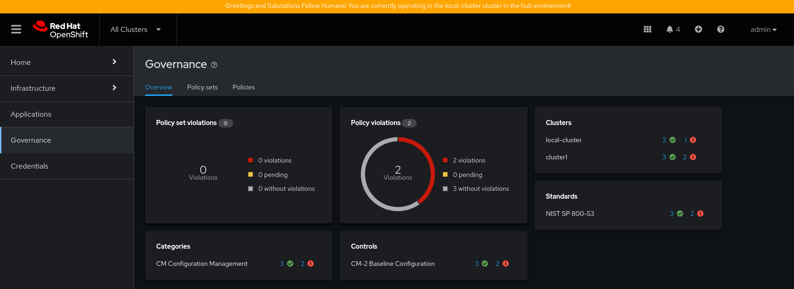
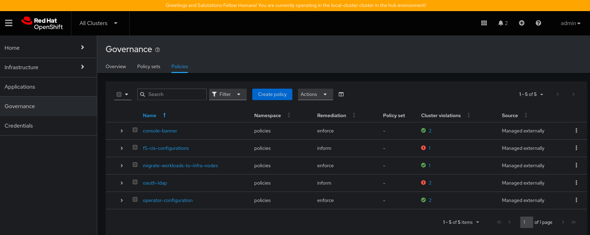

# Using the RHACM Native Application Model

> [!NOTE]
> This methodology is no longer the preferred method of deploying policies via GitOps as a concept. As of [RHACM 2.9](https://access.redhat.com/documentation/en-us/red_hat_advanced_cluster_management_for_kubernetes/2.10/html/applications/managing-applications#application-model-and-definitions), it is recommended that the ArgoCD based OpenShift GitOps operator is used. This method outlined here is not marked as deprecated as of RHACM 2.10. This repository does provide instructions on using the [OpenShift GitOps (ArgoCD) method](../argocd/argocd.md).

## Instructions for Deployment

1.  Apply labels to your various managed clusters to reflect their status as `env=hub`, `env=dev`, or `env=prod`. This is used to correctly assigned the banner color and message in the various files in `policies/hub-cluster-templates-configs/`. You can also create other environment names if these are not set.

2.  Create a `policies` namespace if one doesn't already exist, and switch to it. If you want to use a different namespace, this can be altered in `gitops-policies-channel-and-subscription.yaml` and `policies/configuration/configuration-policies.yaml`

    ```console
    $ oc new-project policies
    $ oc project policies
    ```

3.  Since RHACM 2.4, `policy.open-cluster-management.io/v1` resources are no longer deployed by an application subscription by default. A subscription administrator needs to deploy the application subscription to change this default behavior. Assuming the user you have logged in as doesn't already have this `cluster-role` run the following command:

    ```console
    $ oc adm policy add-cluster-role-to-user open-cluster-management:subscription-admin $(oc whoami)
    ```

    If you don't run the prior command you will see an error like the below appear:

    ```console
    $ oc get subscriptions gitops-policies-subscription-local -o yaml
    [...]
      appstatusReference: kubectl get appsubstatus -n policies gitops-policies-subscription
      lastUpdateTime: "2024-04-06T19:09:41Z"
      message: Active
      phase: Failed
      reason: 'not deployed by a subscription admin. the resource apiVersion: policy.open-cluster-management.io/v1
        kind: PlacementBinding is not deployed, not deployed by a subscription admin.
        the resource apiVersion: policy.open-cluster-management.io/v1 kind: Policy is
        not deployed'
    ```

    For more information on this consult: [Product Documentation: RHACM: Granting subscription administrator privilege](https://access.redhat.com/documentation/en-us/red_hat_advanced_cluster_management_for_kubernetes/2.10/html-single/applications/index#granting-subscription-admin-privilege)

4.  Finally run the following. This will create the `Channel` and `Subscription` objects to subscribe to this repository as well as the `ManagedClusterSetBinding` to bind the `policies` namespace and the `global` ClusterSet. 

    ```console
    $ oc create -f ./acm-native-gitops/gitops-policies-channel-and-subscription.yaml
    ```

5.  Now you should be able to see the policies in your RHACM console, and with a little bit of time, the `console-banner`, `migrate-workloads-to-infra-nodes`, and `operator-configuration` policies should deploy since the `remediationAction: enforce` is set.

    

    

## Instructions for Removal

1.  Run the following commands:
    ```console
    $ oc delete channel.apps.open-cluster-management.io  gitops-policies-channel -n policies
    $ oc delete subscriptions.apps.open-cluster-management.io  gitops-policies-subscription -n policies
    $ oc delete ManagedClusterSetBinding global -n policies
    ```
    This will delete the three objects we created using the `policies/gitops-policies-channel-and-subscription.yaml` file.

2.  That's it. You're done! RHACM will take care of deleting all the policies, placements, etc... that were generated by the `subscription` to this repository. 

## Forking the Repository

If you are trying to fork this repositoryto make your own changes or convert it to a private repo, you will need to edit the `Channel` object specified in `gitops-policies-channel-and-subscription.yaml`. If you decide to secure the repo, you will also need to follow these instructions [Product Documentation: RHACM: Configuring application channel and subscription for a secure Git connection](https://access.redhat.com/documentation/en-us/red_hat_advanced_cluster_management_for_kubernetes/2.10/html-single/applications/index#configuring-git-channel)