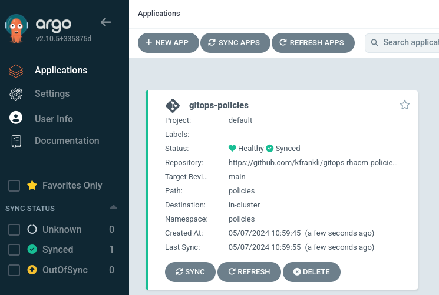
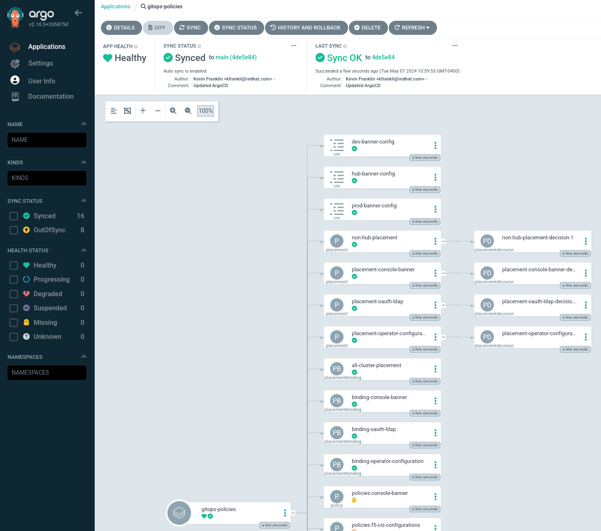

# Using the Argo CD based OpenShift GitOps Operator (Recommended)

This methodology using the Argo CD based OpenShfit GitOps Operator is the preferred method of deploying policies via GitOps as a concept as of [RHACM 2.9](https://docs.redhat.com/en/documentation/red_hat_advanced_cluster_management_for_kubernetes/2.13/html/applications/managing-applications#application-model-and-definitions).

> [!TIP]
> Admonition blocks will be used to call out changes that maybe needed to support deploying this in a disconnected FIPS cluster.

## Prerequisite: OpenShift GitOps Operator on the RHACM Hub Cluster

This section outlines how to install and configure the OpenShift GitOps Operator on the RHACM Hub Cluster. If this has already been done, you can skip this section.

## Prerequisite: Disconnected Image Mirroring

If the cluster is disconnected, the images will have to be mirrored. Assuming you are using the `oc-mirror` utility, you will need a mirroring configuration similar to the below:

```console
$ cat << EOF > /mnt/low-side-data/imageset-config.yaml
---
kind: ImageSetConfiguration
apiVersion: mirror.openshift.io/v1alpha2
storageConfig:
  local:
    path: ./
mirror:
  operators:
  - catalog: registry.redhat.io/redhat/redhat-operator-index:v4.18
    packages:
    - name: web-terminal
    - name: advanced-cluster-management
    - name: multicluster-engine
    - name: openshift-gitops-operator
  helm: {}
EOF

$ oc-mirror --config imageset-config.yaml file:///mnt/low-side-data
```

## Installing OpenShift GitOps Operator on the RHACM Hub Cluster

This section will outline how to use the CLI to install the OpenShift GitOps Operator based on the following documentation: [Product Documentation: Red Hat OpenShift GitOps: Installing GitOps](https://docs.openshift.com/gitops/1.16/installing_gitops/installing-openshift-gitops.html#installing-gitops-operator-using-cli_installing-openshift-gitops).

1.  Create a `openshift-gitops-operator` namespace if one doesn't already exist, and switch to it.

    ```console
    $ oc create ns openshift-gitops-operator
    $ oc project openshift-gitops-operator
    ```

    The reason you're using the `oc create namespace` is running `oc new-project` will fail. For example:?

    ```console
    $ oc new-project openshift-gitops-operator
    Error from server (Forbidden): project.project.openshift.io "openshift-gitops-operator" is forbidden: cannot request a project starting with "openshift-"
    ```

2.  Apply the `OperatorGroup` object.

    ```console
    $ cat ./argocd/gitops-operator-group.yaml
    apiVersion: operators.coreos.com/v1
    kind: OperatorGroup
    metadata:
      name: openshift-gitops-operator
      namespace: openshift-gitops-operator
    spec:
      upgradeStrategy: Default
    $ oc apply -f ./argocd/gitops-operator-group.yaml
    ```

3.  Apply the Subscription object to subscribe the operator in the `openshift-gitops-operator` namespace.

    ```console
    $ cat ./argocd/openshift-gitops-sub.yaml
    apiVersion: operators.coreos.com/v1alpha1
    kind: Subscription
    metadata:
      name: openshift-gitops-operator
      namespace: openshift-gitops-operator
    spec:
      channel: latest 
      installPlanApproval: Automatic
      name: openshift-gitops-operator 
      source: redhat-operators 
      sourceNamespace: openshift-marketplace
    $ oc apply -f ./argocd/openshift-gitops-sub.yaml
    ```

    > [!TIP]
    > Disconnected Tip: You will need to modify the `source:` field for a disconnected install
    > ```
    > $ cat << EOF > ./argocd/openshift-gitops-sub.yaml
    > ---
    > apiVersion: operators.coreos.com/v1alpha1
    > kind: Subscription
    > metadata:
    >   name: openshift-gitops-operator
    >   namespace: openshift-gitops-operator
    > spec:
    >   channel: latest 
    >   installPlanApproval: Automatic
    >   name: openshift-gitops-operator 
    >   source: cs-redhat-operator-index
    >   sourceNamespace: openshift-marketplace
    > EOF
    >
    > $ oc apply -f ./argocd/openshift-gitops-sub.yaml
    > ```    

4.  After the installation is complete, verify that all the pods in the `openshift-gitops` namespace are running. This can take a few minutes depending on your network to even return anything.

    ```console
    $ oc get pods -n openshift-gitops
    NAME                                                      	      READY   STATUS    RESTARTS   AGE
    cluster-b5798d6f9-zr576                                   	      1/1 	  Running   0          65m
    kam-69866d7c48-8nsjv                                      	      1/1 	  Running   0          65m
    openshift-gitops-application-controller-0                 	      1/1 	  Running   0          53m
    openshift-gitops-applicationset-controller-6447b8dfdd-5ckgh       1/1 	  Running   0          65m
    openshift-gitops-dex-server-569b498bd9-vf6mr                      1/1     Running   0          65m
    openshift-gitops-redis-74bd8d7d96-49bjf                   	      1/1 	  Running   0          65m
    openshift-gitops-repo-server-c999f75d5-l4rsg              	      1/1 	  Running   0          65m
    openshift-gitops-server-5785f7668b-wj57t                  	      1/1 	  Running   0          53m
    ```

5.  Verify that the pod/s in the `openshift-gitops-operator` namespace are running.

    ```console
    $ oc get pods -n openshift-gitops-operator
    NAME                                                            READY   STATUS    RESTARTS   AGE
    openshift-gitops-operator-controller-manager-664966d547-vr4vb   2/2     Running   0          65m
    ```

## Configure Basic RBAC Policy For OpenShift GitOps

OpenShift GitOps manages access to Argo CD resources through the RBAC policy set under Argo CD instance. By default any [`cluster-admin` users don't have rights to Argo CD](https://access.redhat.com/solutions/6975821).

1.  Review the current RBAC policy.

    ```console
    $ oc get argocd -n openshift-gitops -o yaml | grep -i rbac -A10
    rbac:
      defaultPolicy: ""
      policy: |
        g, system:cluster-admins, role:admin    <--[group `system:cluster-admins` has `role:admin`]
        g, cluster-admins, role:admin           <--[group `cluster-admins`        has `role:admin`]
      scopes: '[groups]'
    redis:
      resources:
        limits:
          cpu: 500m
      scopes: '[groups]'
    ```

2.  Check to see if your current user is a member of any groups.

    ```console
    $ oc get groups
    ```

3.  If your user wasn't a member of any of the groups mentioned in step one, we can either add them to one of those groups or create one. In this case, we are making one `argocdadmins`.

    ```console
    $ oc adm groups new argocdadmins
    ```

4.  Add your user to the group.

    ```console
    $ oc adm groups add-users argocdadmins $(oc whoami)
    ```

5.  Edit the `argocd` instance in the `openshift-gitops` namespace to add a new admin group by adding `g, argocdadmins, role:admin`.

    ```console
    $ oc edit argocd -n openshift-gitops
    [...]
      rbac:
        defaultPolicy: ""
        policy: |
          g, system:cluster-admins, role:admin
          g, cluster-admins, role:admin
          g, argocdadmins, role:admin
        scopes: '[groups]'
    [...]
    ```

## Configure OpenShift GitOps to Integrate with the Kustomize Policy Generator Plugin

Now that OpenShift GitOps (Argo CD) has been installed and basic RBAC enabled, we can configure it to support the [Kustomize Policy Generator plugin, and integrate it with RHACM](https://access.redhat.com/documentation/en-us/red_hat_advanced_cluster_management_for_kubernetes/2.13/html/gitops/gitops-overview#policy-gen-install-on-openshift-gitops).

1.  We will need to modify `ArgoCD` instance to provision a init container to copy the Kustomize Policy Generator plugin to the GitOp Container, and add the `--enable-alpha-plugins` argument. First backup the existing `ArgoCD` object for reference.

    ```console
    $ oc get argocd openshift-gitops -n openshift-gitops -o yaml > openshift-gitops.yaml
    ```

2.  Now we will apply apply a patch file. Further details on this [can be found here](https://access.redhat.com/documentation/en-us/red_hat_advanced_cluster_management_for_kubernetes/2.13/html/gitops/gitops-overview#policy-gen-install-on-openshift-gitops). Not that this differs from the RHACM 2.10 docs which specify an object of `apiVersion: argoproj.io/v1alpha1` but for GitOps 1.12, the object created is of type `apiVersion: argoproj.io/v1beta1`, therefore this is why the patch differs from the aforementioned documentation. Also there is a error in the mount points in the docs at time of writing, which I have corrected in my repository. 

    ```console
    $ cat ./argocd/argocd-patch.yaml
    apiVersion: argoproj.io/v1beta1
    kind: ArgoCD
    metadata:
      name: openshift-gitops
      namespace: openshift-gitops
    spec:
      kustomizeBuildOptions: --enable-alpha-plugins
      repo:
        env:
        - name: KUSTOMIZE_PLUGIN_HOME
          value: /etc/kustomize/plugin
        initContainers:
        - args:
          - -c
          - cp /policy-generator/PolicyGenerator-not-fips-compliant /policy-generator-tmp/PolicyGenerator
          command:
          - /bin/bash
          image: registry.redhat.io/rhacm2/multicluster-operators-subscription-rhel9:v2.13
          name: policy-generator-install
          volumeMounts:
          - mountPath: /policy-generator-tmp
            name: policy-generator
        volumeMounts:
        - mountPath: /etc/kustomize/plugin/policy.open-cluster-management.io/v1/policygenerator
          name: policy-generator
        volumes:
        - emptyDir: {}
          name: policy-generator
    $ oc -n openshift-gitops patch argocd openshift-gitops --type merge --patch "$(cat ./argocd/argocd-patch.yaml)" 
    ```

    > [!TIP]
    > Disconnected Tip: You will need to modify the image registry and image to match what you pulled in to your environment via `oc-mirror`
    > ```
    > cat << EOF > ./argocd/argocd-patch.yaml
    > ---
    > apiVersion: argoproj.io/v1beta1
    > kind: ArgoCD
    > metadata:
    >   name: openshift-gitops
    >   namespace: openshift-gitops
    > spec:
    >   kustomizeBuildOptions: --enable-alpha-plugins
    >   repo:
    >     env:
    >     - name: KUSTOMIZE_PLUGIN_HOME
    >       value: /etc/kustomize/plugin
    >     initContainers:
    >     - args:
    >       - -c
    >       - cp /policy-generator/PolicyGenerator-not-fips-compliant /policy-generator-tmp/PolicyGenerator
    >       command:
    >       - /bin/bash
    >       image: $MY_REGISTRY/rhacm2/multicluster-operators-subscription-rhel9:$MY_IMAGETAG
    >       name: policy-generator-install
    >       volumeMounts:
    >       - mountPath: /policy-generator-tmp
    >         name: policy-generator
    >     volumeMounts:
    >     - mountPath: /etc/kustomize/plugin/policy.open-cluster-management.io/v1/policygenerator
    >       name: policy-generator
    >     volumes:
    >     - emptyDir: {}
    >       name: policy-generator
    > EOF
    > oc -n openshift-gitops patch argocd openshift-gitops --type merge --patch "$(cat ./argocd/argocd-patch.yaml)" 
    > ```

3.  You should see a new `openshift-gitops-repo-server-XXXXXXXX-XXXXX` pod start to spin up. Waitt for it to become ready `1/1`.

    ```console
    $ oc get pods -n openshift-gitops
    NAME                                                          READY   STATUS    RESTARTS   AGE
    cluster-84c744d68d-k6ngt                                      1/1     Running   0          6m40s
    kam-67b754468-gzrpl                                           1/1     Running   0          6m40s
    openshift-gitops-application-controller-0                     1/1     Running   0          6m37s
    openshift-gitops-applicationset-controller-84ddbb9469-hxvwz   1/1     Running   0          6m37s
    openshift-gitops-dex-server-864c46c7b9-rx6fk                  1/1     Running   0          6m37s
    openshift-gitops-redis-5684c6fc5b-gc87d                       1/1     Running   0          6m38s
    openshift-gitops-repo-server-75d686dbbf-vc46m                 0/1     Running   0          6s
    openshift-gitops-repo-server-774f57885c-vlg84                 1/1     Running   0          6m38s
    openshift-gitops-server-76cf7bd6c8-rg6xb                      1/1     Running   0          6m37s
    ```

4.  Now that OpenShift GitOps has the binary available, we will need to grant access for the ArgoCD instance to create policies on the RHACM hub instance. First create a custom `ClusterRole` with full rights to the various `open-cluster-management.io` objects we want Argo CD to interact and manage on our behalf.

    ```console
    $ cat ./argocd/openshift-gitops-policy-admin.yaml
    kind: ClusterRole
    apiVersion: rbac.authorization.k8s.io/v1
    metadata:
      name: openshift-gitops-policy-admin
    rules:
      - verbs:
          - get
          - list
          - watch
          - create
          - update
          - patch
          - delete
        apiGroups:
          - policy.open-cluster-management.io
        resources:
          - policies
          - policysets
          - placementbindings
      - verbs:
          - get
          - list
          - watch
          - create
          - update
          - patch
          - delete
        apiGroups:
          - apps.open-cluster-management.io
        resources:
          - placementrules
      - verbs:
          - get
          - list
          - watch
          - create
          - update
          - patch
          - delete
        apiGroups:
          - cluster.open-cluster-management.io
        resources:
          - placements
          - placements/status
          - placementdecisions
          - placementdecisions/status
    $ oc apply -f ./argocd/openshift-gitops-policy-admin.yaml
    ```

5.  Lastly create a `ClusterRoleBinding` to grant Argo CD access to the newly created `ClusterRole`. 

    ```console
    $ cat ./argocd/openshift-gitops-policy-admin-clusterolebinding.yaml
    kind: ClusterRoleBinding
    apiVersion: rbac.authorization.k8s.io/v1
    metadata:
      name: openshift-gitops-policy-admin
    subjects:
      - kind: ServiceAccount
        name: openshift-gitops-argocd-application-controller
        namespace: openshift-gitops
    roleRef:
      apiGroup: rbac.authorization.k8s.io
      kind: ClusterRole
      name: openshift-gitops-policy-admin
    $ oc apply -f ./argocd/openshift-gitops-policy-admin-clusterolebinding.yaml
    ```

## Deploying our policies

1.  Apply labels to your various managed clusters to reflect their status as `env=hub`, `env=dev`, or `env=prod`. This is used to correctly assigned the banner color and message in the various files in `policies/hub-cluster-templates-configs/`. You can also create other environment names if these are not set.

2.  We're first going to create a `policies` namespace to deploy our Policies in.

    ```console
    $ oc create ns policies
    $ oc project policies
    ```

3.  The policies here are expected to run on all clusters, so we're going to bind the newly created `policies` namespace to the default `global` `ClusterSet`.
 
    ```console
    $ cat ./argocd/global-managedclustersetbinding.yaml 
    apiVersion: cluster.open-cluster-management.io/v1beta2
    kind: ManagedClusterSetBinding 
    metadata:
      name: global
      namespace: policies
    spec:
      clusterSet: global
    $ oc create -f ./argocd/global-managedclustersetbinding.yaml 
    ```

4.  Now we will create an ArgoCD application to listen to this repository and push out the Policies.

    ```console
    $ cat ./argocd/gitops-policies-application.yaml
    apiVersion: argoproj.io/v1alpha1
    kind: Application
    metadata:
      name: gitops-policies
      namespace: openshift-gitops
    spec:
      destination:
        namespace: policies
        server: https://kubernetes.default.svc
      project: default
      source:
        repoURL: https://github.com/kfrankli/gitops-rhacm-policies.git
        targetRevision: main
        path: policies
      syncPolicy:
        automated:
          prune: true
          selfHeal: true
    $ oc create -f ./argocd/gitops-policies-application.yaml
    ```

5.  We should be able to see our application deployed in Argo CD. To get to the Argo CD console, retrieve the route:

    ```console
    $ oc get route openshift-gitops-server -n openshift-gitops
    ```
    

    

6.  If you go to the RHACM console you should see the deployed policies.

    

    

## References

* [Product Documentation: RHACM: GitOps Overview](https://access.redhat.com/documentation/en-us/red_hat_advanced_cluster_management_for_kubernetes/2.13/html/gitops/gitops-overview)
* [Product Documentation: OpenShift: CI/CD: GitOps](https://access.redhat.com/documentation/en-us/openshift_container_platform/4.18/html/cicd/gitops)
* [Product Documentation: OpenShift GitOps](https://docs.openshift.com/gitops/1.16/understanding_openshift_gitops/about-redhat-openshift-gitops.html)
* [Product Documentation: OpenShift GitOps: Configuring Argo CD RBAC](https://docs.openshift.com/gitops/1.16/accesscontrol_usermanagement/configuring-argo-cd-rbac.html)
* [Product Documentation: RHACM: Managing policy definitions with OpenShift Container Platform GitOps (Argo CD)](https://access.redhat.com/documentation/en-us/red_hat_advanced_cluster_management_for_kubernetes/2.13/html/gitops/gitops-overview#policy-gen-install-on-openshift-gitops)
* [Red Hat Solutions: Unable to create application with user having cluster-admin privileges in Argo CD.](https://access.redhat.com/solutions/6975821)
* [Red Hat Solutions: Add a Kustomize plugin to OpenShift GitOps in RHOCP4](https://access.redhat.com/solutions/6997069)
